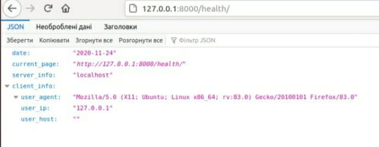

# Lab_3: Вступ до моніторингу.

+ Створив віртуальне середовище, встановив Django
```
pipenv --python 3.6
pipenv install django
```
+ Створив template проекту з назвою adventure,виніс створені файли на рівень вище.
```
pipenv run django-admin startproject adventure

mv adventure/adventure/* adventure/
mv adventure/manage.py ./
``` 
+  Запустив Django сервер
```
pipenv run python manage.py runserver
```
Локальний сервер запущено на порті: 8000

+ Створив новий Django додаток head
```
pipenv run python manage.py startapp head

```
+ Створив нову директорію `./head/templates`, створено файли `./head/templates/index.html` та `./head/urls.py`

+ Добавлення додатку до константи `INSTALLED_APPS`
```python
INSTALLED_APPS = [
    'head',
    'django.contrib.admin',
    'django.contrib.auth',
    'django.contrib.contenttypes',
    'django.contrib.sessions',
    'django.contrib.messages',
    'django.contrib.staticfiles',
]
```
+ Додавання індексації додатку у файлі посилань `urls.py`

```
from django.urls import path, include

urlpatterns = [
    path('admin/', admin.site.urls),
    path('', include('head.urls')),
    path('health/', include('head.urls'))
]
``` 
+ Поєднав функції із реальними URL шляхами head/urls.py
```
    urlpatterns = [
    url(r'^$', views.index, name='index'),
    url(r'health/', views.health, name='health')
]
``` 
+ Встановив модуль `requests` для pipenv
```
pipenv install requests
```

+ Аліаси добавив у Pipfile, виконуються командою `pipenv run [script_name]`
```
[scripts]
server = "python manage.py runserver"
monitor = "python monitoring.py"
```

+ Добавлено логування при помилці підключення до сервера
```
ERROR 2020-11-24 21:22:14,328 root : Сервер недоступний
ERROR 2020-11-24 21:22:14,328 root : Помилка: HTTPConnectionPool(host='localhost', port=8000): Max retries exceeded with url: /health (Caused by NewConnectionError('<urllib3.connection.HTTPConnection object at 0x7f87fff12358>: Failed to establish a new connection: [Errno 111] Connection refused',))
```
+ Встановлено щохвилинне опитування сервера


+ #### Результати JSON відповіді функції health


+ #### Результати зчитування HTML темплейта


