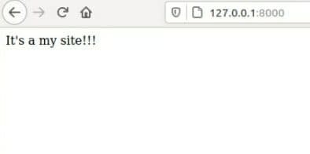
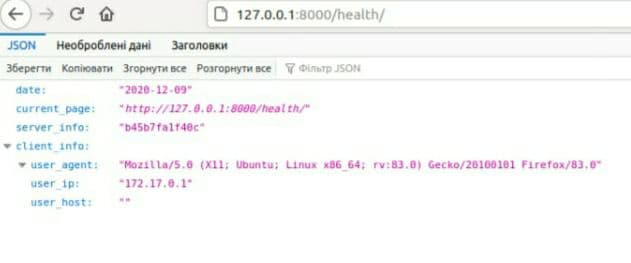

# Lab_4: Робота з Docker.

+ Інсталював Docker.
+ Ознайомився з офіційною документацією по Docker.
+ Перевірив чи докер встановлений і  чи працює правильно, запустив перевірку версії, вивів допомогу та тестовий імедж:
```
docker -v
docker -h
sudo docker run docker/whalesay cowsay Docker is fun

```
Результати виконання команд перенаправляю у файл my_work.log та роблю коміт його до репозиторію. Для цього використовую оператори перенаправлення потоку виводу> i >>.

+ Ознайомився з документацією `Dockerfile`, який описує контент імеджу.
+ Створюю імедж із Django сайтом зробленим у попередній роботі: 
  - Використoвую команди, щоб завантажити базовий імедж з репозиторію:
    ```
    sudo docker pull python:3.6-slim
    sudo docker images
    	REPOSITORY          TAG                 IMAGE ID            CREATED             SIZE
    	python              3.6-slim            29b8dbd5cf2f        5 days ago          111MB
    	docker/whalesay     latest              6b362a9f73eb        5 years ago         247MB
    sudo docker inspect python:3.6-slim
    ```

   - Створюю файл з іменем `Dockerfile` та копіюю туди вміст  файлу з репозиторію.
   - Ознайомлююся із коментарями, щоб зрозуміти структуру написання `Dockerfile`.
   - Замінюю посилання на власний Git репозиторій із моїм веб-сайтом та комічу даний `Dockerfile`.

+ Створюю власний репозиторій на `Docker Hub` Для цього заходжу у власний аккаунт на Docker Hub, переходжу у вкладку `Repositories` і далі натискаю кнопку `Create new repository`. Даю назву репозиторію `lab4_django`.
+ Виконую білд `Docker image` та завантажую його до створеного репозиторію(до цьoго обов'язково логінюся через термінал). Для цього вказую назву та TAG. Оскільки мій репозиторій andee1/lab4_django то команда буде виглядати: 
```
sudo docker build -t andee1/lab4_django -f Dockerfile .
sudo docker images
    REPOSITORY           TAG                 IMAGE ID            CREATED             SIZE
    andee1/lab4_django   latest              54e9155d097a        2 minutes ago       327MB
    python               3.6-slim            29b8dbd5cf2f        5 days ago          111MB
    docker/whalesay      latest              6b362a9f73eb        5 years ago         247MB
sudo docker tag andee1/lab4_django andee1/lab4_django:django
sudo docker push andee1/lab4_django:django
```
- [Посилання на мій Docker Hub репозиторій](https://hub.docker.com/repository/docker/andee1/lab4_django);

+ Запускаю веб-сайт командою:
```
sudo docker run -it --name=django --rm -p 8000:8000 andee1/lab4_django:django
```
 - Переходжу на адресу `http://127.0.0.1:8000`:
    
    

+ Cтворюю  контейнер із програмою моніторингу веб-сайту:
    - створюю ще один `Dockerfile`, у якому поміщаю програму моніторингу (використовую ключ `--file`);
    - виконую білд імеджа та даю йому тег `monitoring`:
    ```
    sudo docker build -t andee1/lab4_django:monitoring -f Dockerfile.monit .
    sudo docker push andee1/lab4_django:monitoring
    ```
    - запускаю два контейнери одночасно (у різних терміналах) та бачу, що програма моніторингу успішно доступається до сторінок веб-сайту (для цього я використав ключ `--net=host`):
    ```
    sudo docker run -it --name=monitor --rm --net=host -v /home/andrii/labs/Lab_4:/app/ andee1/lab4_django:monitoring
    ```
    - commit `Dockerfile.monit` та результати роботи програми моніторингу, запущеної з Docker контейнера - `server.log`.

