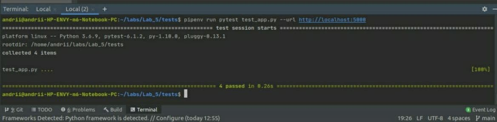
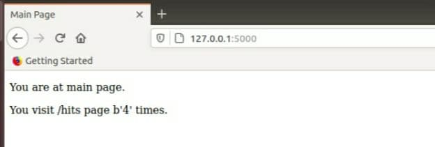
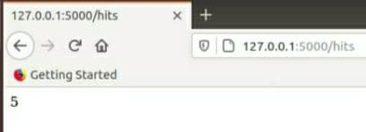
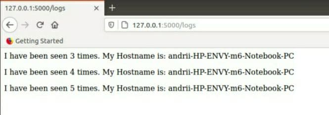
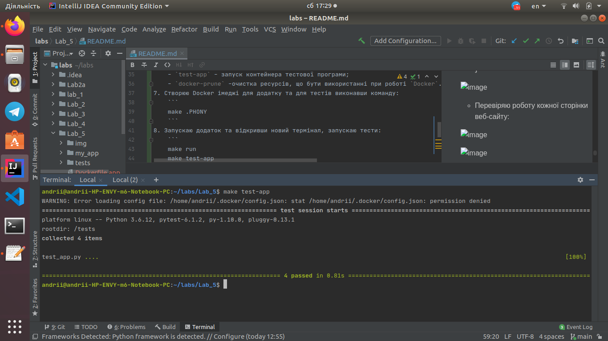
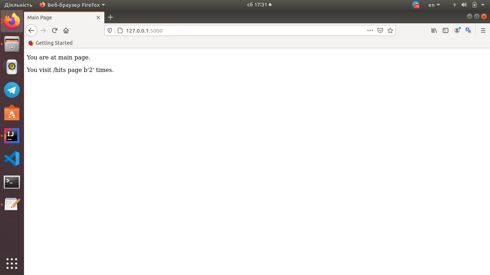
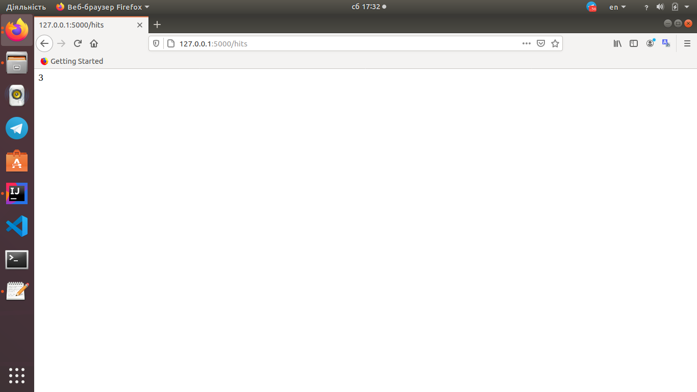
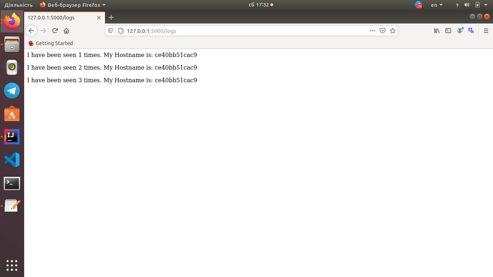
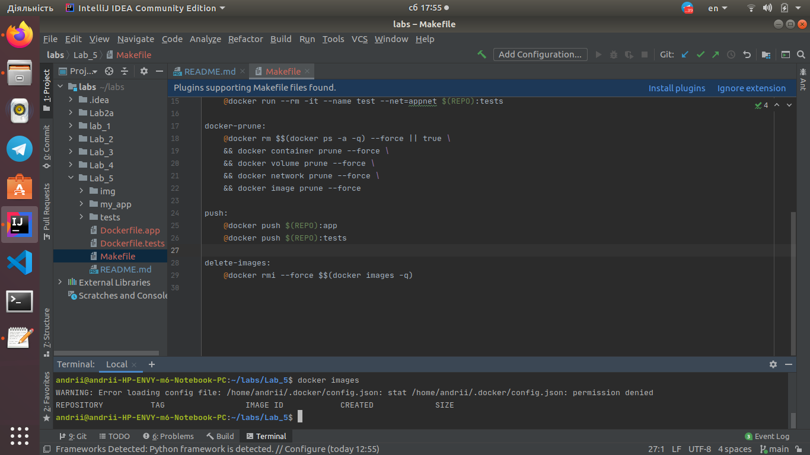

## Lab_5: Робота з Docker.

Makefile
---
1. Прочитав про `docker-compose`.
2. Ознайомився з бібліотекою `Flask`.
3. Створив папку `my_app`, `tests`. Скопіював файли з репозиторію `devops_course`, ознайомився з файлами.
4. Перевірив проект на працездатність , виконуючи наступні команди:
````
pipenv --python 3.6
pipenv install -r requirements.txt
pipenv run python app.py
````
+ Ініціалізував середовище та запустив тест
````
pipenv run pytest test_app.py --url http://localhost:5000
````
   - При запуску додатку виникла помилка з'єднання з  `redis-server`. Установив `redis-server` та налаштував його на вискористання.
   - Для того, щоб тести працювали створив папку `logs` і лог-файл `app.log` у папці з додатком. Після цього тести проходять успішно:

   
   - Видаляю всі файли, що створились в процесі запуску (Pipfile, Pipfile.lock);
    
   - Перевіряю роботу сайту, перейшовши на кожну із сторінок:
   
   
   
   
   
   

5. Створив два Dockerfile з іменами як у репозиторі `devops_course` та Makefile, який допоможе автоматизувати процес розгортання.
6. Ознайомлююся із вмістом Dockerfile та Makefile та його директивами:
    - `STATES` і `REPO` - змінні які містять назви тегів та назву Docker Hub репозиторію відповідно;
    - `.PHONY` - утиліта `make`, яка вказує файлу, що переліченні нище цілі не є файлами;
    - `$(STATES)` - ціль, призначення для білду контейнера;
    - `run` - ціль, призначення для створення мережі, у якій буде працювати додаток; запуску додатку і сховища `redis`;
    - `test-app` - запуск контейнера тестової програми;
    - `docker-prune` -очистка ресурсів, що бути використанні при роботі `Docker`.
7. Створюю Docker імеджі для додатку та для тестів виконавши команду:
    ```
    make .PHONY
    ```
8. Запускаю додаток та відкривши новий термінал, запускаю тести:
    ```
    make run
    make test-app
    ```
    - Переконуюся, що тести пройшли успішно:
       
    
    - Перевіряю роботу кожної сторінки веб-сайту:
    
    
    
    
    
    
    
9. Зупиняю проект, натиснувши `Ctrl+C`, та очищаю всі ресурси Docker за допомогою команди:
    ```
    make docker-prune
    ```
10. Створюю директиву в `Makefile` для завантаження створених імеджів у Docker Hub репозиторій. Завантажую імеджі до репозиторію `andee1/lab5` командою:
    ```
    make push
    ```
    - [Посилання на Docker Hub репозиторій](https://hub.docker.com/reposidoctory/docker/andee1/lab5);

11. Видаляю створені та завантаженні імеджі. Створюю директиву `delete-images` в `Makefile`, яка автоматизує процес видалення імеджів. Команда `docker images` виводить наступне:
    
    

Docker-compose
---