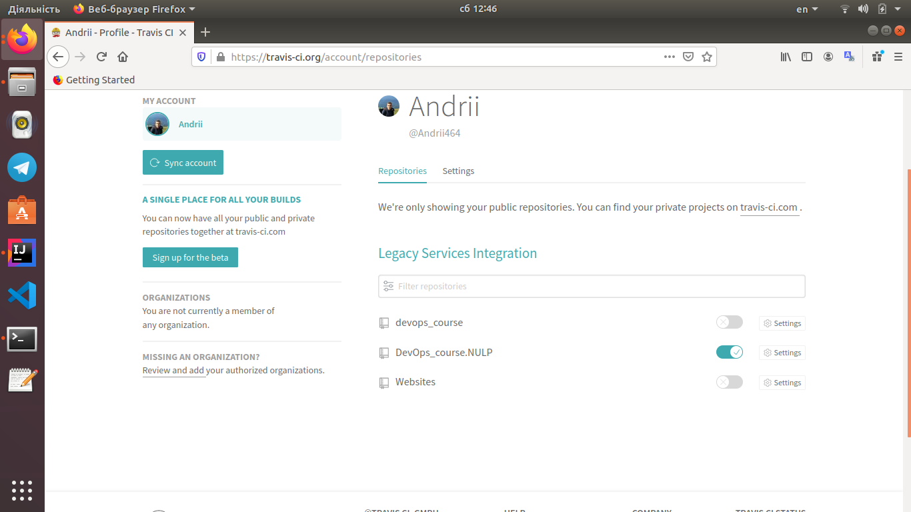

Lab_6: Автоматизація за допомогою CI/CD серверів.
-

1. Реєструюся на сайті `Travis` - використовую вхід за допомогою GitHub креденшалів і погоджуюся з дозволами, які вимагає `Travis`.

2. Додаю репозиторій до `Travis`:

     
     
3. Для того, щоб `Travis` знав, які кроки потрібно виконати над кодом у кореневій папці  репозиторію використовується файл `.travis.yaml`. Створюю у свому `GitHub` репозиторію такий самий файл та копіюю туди вміст з репозиторію `devops_course`. `Travis` повинен автоматично знайти даний файл та виконувати кроки, описані у ньому, при кожному новому коміті в `main` гілку.

4. Для того, щоб налаштувати інтеграцію з `Docker Hub`, створюю змінні середовища для авторизації.

5. Оскільки білд представлений у репозиторії `devops_course` не враховує всі попередні домашні завдання, тому:
   - переписую білд lab 2, з використання кроків записаних у `Makefile`;
   - переписую білд lab 4, з ще одним `DockerFile` для контейнера моніторингу;
   - переписую білд lab 5 і додаю кроки `Makefile`, які робили push імеджів у `Docker Hub` репозиторій;
   

6. Посилання на  [Travis build](https://travis-ci.org/github/Andrii464/DevOps_course.NULP).